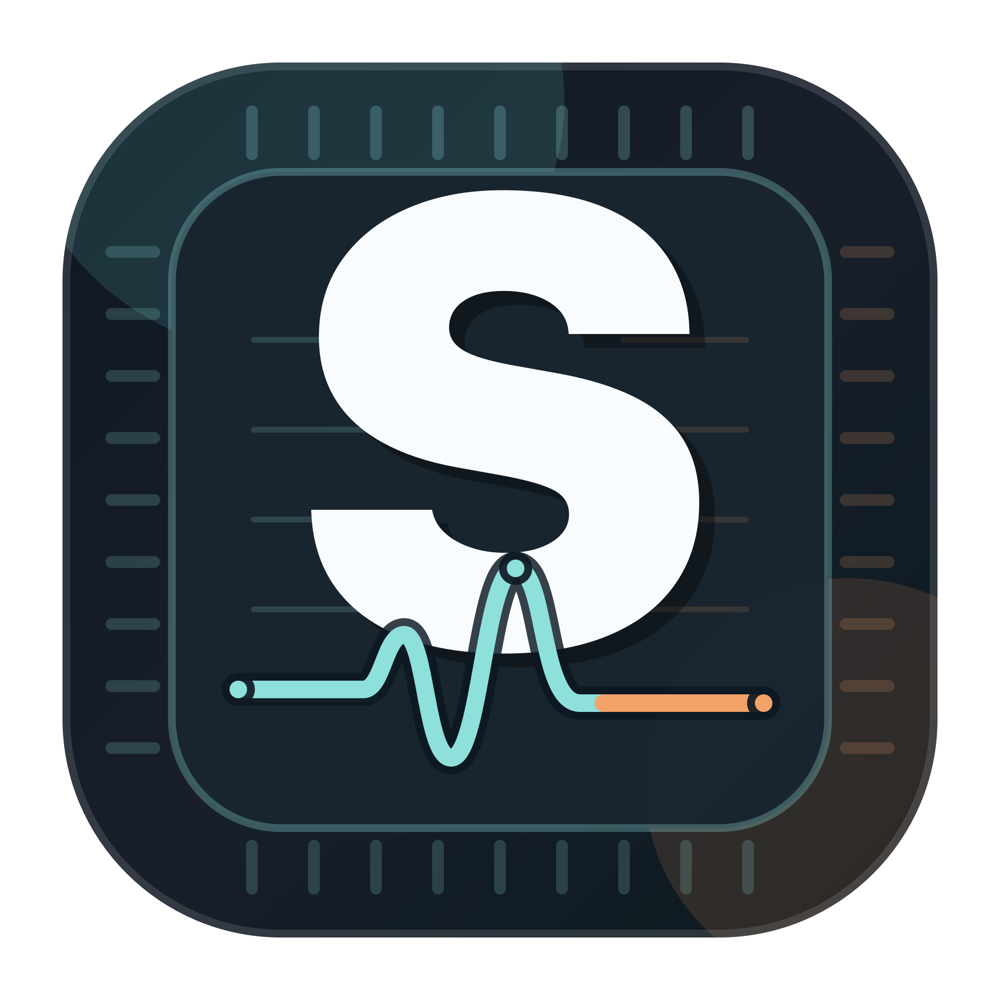
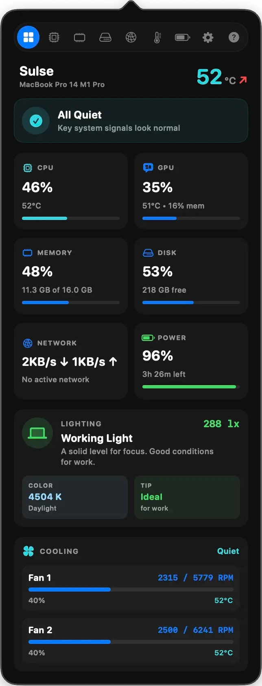

# 💻 Sulse — Feel the pulse of your Mac. Without the noise.

<p align="center">
  
</p>

<p align="center">
  <strong>Sulse</strong> is a lightweight, elegant macOS system monitor. Track CPU heat, memory, disk activity, network speed, and battery health directly from your menu bar with absolute zero overhead.
</p>

<p align="center">
  🌐 For detailed information, interactive previews, and complete feature walkthroughs, visit the official website: <a href="https://sulse.fcreator.app"><strong>sulse.fcreator.app</strong></a>
</p>

<p align="center">
  
</p>

<p align="center">
  <a href="https://github.com/tepliy/sulse-app/releases/latest">
    
  </a>
  
</p>

<p align="center">
    <!-- virustotal-badge-start -->\n  <a href="https://www.virustotal.com/gui/file-analysis/YzQ1ZTFiM2NmNGFhMmU0NDYxMTExYWZjYmYwNDMyNmQ6MTc4MDY1NDgyNg==/detection" target="_blank">\n    \n  </a>\n  <!-- virustotal-badge-end -->
</p>

---

## ✨ Features

### 🤫 Whisper Quiet, Feather Light
Sulse runs silently in the background with zero performance impact. Written completely from scratch in Swift 6 using native Apple Silicon background telemetry, it accesses Mac sensors with direct native kernel APIs and sleeps smoothly when you're not viewing the UI. You get real-time tracking, 0% UI thread overhead, and total peace of mind.

### 🛡️ Smart Menu Bar
Let Sulse automatically cycle through key metrics, adapting in real-time to your Mac's current workload, or take control and build your own custom status layout.

### ❤️ Free, Clean & Private
No subscriptions, no annoying pop-ups, and absolutely no background telemetry tracking your habits. Just a beautifully crafted, native utility designed for anyone who loves clean and lightweight tools.

---

## 📊 Rich Telemetry Panels

*   **Unified Dashboard**: Open the dashboard and instantly see if anything needs your attention — a clear health status, potential issues like overheating or low storage, and even a heads-up if your room lighting isn't ideal for comfortable screen time.
*   **CPU & GPU Cores**: Find out which cores are busy and which are resting — with efficiency and performance cores shown separately for Apple Silicon. Live frequency, temperature, and a list of the top apps using the most processing power.
*   **Memory & Apps**: A friendly breakdown of your memory usage — how much is taken by apps, how much the system locked for itself, and how much is being compressed. Plus, a list of the hungriest apps so you know exactly what to close first.
*   **Disk I/O & Scan**: See a clear breakdown of what's eating up storage by file type (videos, photos, archives, etc.) or by folder to spot the heaviest ones. Switch between views in one tap, open any folder directly in Finder, and get a heads-up when free space is running low.
*   **Network Speeds**: See download and upload speeds at a glance, check if your VPN is active, view your public IP and location, explore Wi-Fi signal strength, and see connected Bluetooth devices with their battery levels.
*   **Sensors & Room Light**: Sulse measures the ambient light in your room in Lux, tells you if it's too dim or too bright for comfortable work, and shows the color temperature in Kelvin. Below, animated fan gauges spin in real time matching your actual cooling speed.
*   **Power & Battery**: Set a charge limit at 80%, 85%, or 90% to keep your battery healthy for years. See exactly how power flows, track temperature, health percentage, charge cycles, and AC Bypass status when plugged in but not charging.
*   **Smart Customization**: Choose Smart Menu Bar mode to automatically show what matters most right now, or build your own custom layout with any combination of metrics.

---

## 📦 Installation & Unsigned App Setup

Sulse is a free, independent project, and this is its very first public release. Since I'm still exploring how much interest there is in the app, and it is distributed completely free of charge, purchasing a paid Apple Developer program membership just to sign the code is not feasible at this early stage. Therefore, **it is not signed with an Apple Developer certificate yet**, and macOS Gatekeeper will block it by default. 

Please follow these quick steps to install and run the app:

1. Go to the [**Releases**](https://github.com/tepliy/sulse-app/releases) page and download **`Sulse.dmg`**.
2. Open the downloaded `.dmg` and drag **Sulse** to your **Applications** folder.
3. Choose **one of the methods** below to launch the app:

### Method A: Right-Click Open (Easiest)
1. Open your **Applications** folder in Finder.
2. Hold the `Control` key (or right-click) and click on **Sulse**.
3. Select **Open** from the menu.
4. Click **Open** in the confirmation dialog.

### Method B: Terminal Command (If macOS says the file is "damaged")
If macOS shows an error or refuses to launch it, open your **Terminal** app and run the following command:
```bash
xattr -cr /Applications/Sulse.app
```
*This command safely removes the quarantine flag that macOS automatically attaches to unsigned internet downloads.*

## 💬 Feedback & Support

Sulse is in its early stages, and your feedback is incredibly valuable! 
* **Have a bug or a feature request?** Please [open an Issue](https://github.com/tepliy/sulse-app/issues).
* **Enjoying the app?** Please **star this repository** ⭐ to show your support and help others discover Sulse!

---

## 🔒 Source Code & License

*   **Proprietary & Closed Source**: Sulse is a closed-source application. The source code is private.
*   **Terms of Use**: By downloading the application, you agree to the [End User License Agreement (EULA)](file:///Users/tepliy/github/sulse-app/LICENSE.md).

---

<p align="center">
  Made with ❤️ for macOS.
</p>
